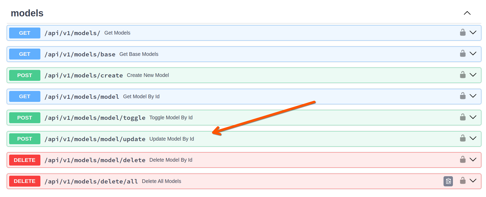

# OpenWebUI Bulk Model Updater

This repository contains a simple Python script for updating model configurations in bulk within OpenWebUI.

## Purpose

In OpenWebUI, model configurations consist of base models (provided by your connections) and derived models (system prompts). When you have a large instance with hundreds or thousands of models all tied to a base model that becomes deprecated, updating these individually through the UI would be prohibitively time-consuming.

This Python script uses the OpenWebUI API to connect to the data endpoint, allowing you to efficiently update multiple model configurations at once.

## Usage

The script connects to the OpenWebUI API to perform bulk updates of model configurations. To use it:

1. Enable development mode in your OpenWebUI instance to view the Swagger docs and available endpoints
2. Get your API token from the OpenWebUI settings
3. Configure the script with your instance URL and authentication details
4. Run the script to update model configurations in bulk

## Authentication

The example script includes support for Cloudflare service header authentication. If you don't use Cloudflare, you can modify the script for your specific authentication methods or remove authentication entirely if your setup doesn't require it.

## Prerequisites

- Python 3.x
- Access to an OpenWebUI instance
- API token from your OpenWebUI settings

