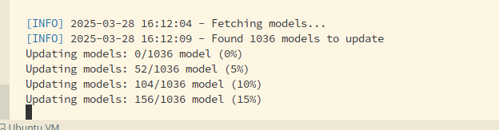

# OpenWebUI Bulk Model Updater

This repository contains Python scripts for updating model configurations in bulk within OpenWebUI.

## Purpose

In OpenWebUI, model configurations consist of base models (provided by your connections) and derived models (system prompts). When you have a large instance with hundreds or thousands of models all tied to a base model that becomes deprecated, updating these individually through the UI would be prohibitively time-consuming.

These Python scripts use the OpenWebUI API to connect to the data endpoint, allowing you to efficiently update multiple model configurations at once.

## Versions

This repository includes two versions of the model updater:

1. **Local Server Version** (`update-models.py`) - Designed to be run directly on the server hosting OpenWebUI:
   - Connects directly to the OpenWebUI API via local container IP
   - Features multi-parallel processing for faster updates
   - No external authentication required
   - Ideal for direct server access scenarios

2. **External Client Version** (`external-update-models.py`) - Designed to connect remotely through Cloudflare:
   - Connects through Cloudflare with proper authentication
   - Includes support for Cloudflare service header authentication
   - Suitable for remote administration scenarios
   - Can be adapted for various authentication methods

Both versions share the core functionality of bulk updating model configurations but are optimized for different deployment scenarios.

## Usage

The scripts connect to the OpenWebUI API to perform bulk updates of model configurations. To use them:

1. Enable development mode in your OpenWebUI instance to view the Swagger docs and available endpoints
2. Get your API token from the OpenWebUI settings
3. Configure the appropriate script with your instance URL and authentication details
4. Run the script to update model configurations in bulk

## Authentication

The external version includes support for Cloudflare service header authentication. If you don't use Cloudflare, you can modify the script for your specific authentication methods or remove authentication entirely if your setup doesn't require it.

The local version is designed to connect directly to the OpenWebUI container and doesn't require external authentication.

## Prerequisites

- Python 3.x
- Access to an OpenWebUI instance
- API token from your OpenWebUI settings
